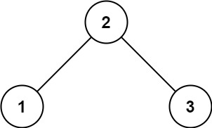

# Basic Binary Search Tree

## LeetCode
- 98.Validate Binary Search Tree
- 230.Kth Smallest Element in a BST
- 538.Convert BST to Greater Tree
- 1038.Binary Search Tree to Greater Sum Tree


### 98. Validate Binary Search Tree
Given the root of a binary tree, determine if it is a valid binary search tree (BST).

A valid BST is defined as follows:

The left 
- subtree of a node contains only nodes with keys less than the node's key.
- The right subtree of a node contains only nodes with keys greater than the node's key.
- Both the left and right subtrees must also be binary search trees.
 

Example 1:



```
Input: root = [2,1,3]
Output: true
```

Example 2:


```
Input: root = [5,1,4,null,null,3,6]
Output: false
Explanation: The root node's value is 5 but its right child's value is 4.
```

Constraints:
- The number of nodes in the tree is in the range [1, 104].
- -231 <= Node.val <= 231 - 1

#### Solution
```
/*
 * 1/24/2023
 */
 
/**
 * Definition for a binary tree node.
 * public class TreeNode {
 *     int val;
 *     TreeNode left;
 *     TreeNode right;
 *     TreeNode() {}
 *     TreeNode(int val) { this.val = val; }
 *     TreeNode(int val, TreeNode left, TreeNode right) {
 *         this.val = val;
 *         this.left = left;
 *         this.right = right;
 *     }
 * }
 */
class Solution {
    boolean isValidBST(TreeNode root) {
        return isValidBST(root, null, null);
    }

    /* max.val > root.val > min.val */
    boolean isValidBST(TreeNode root, TreeNode min, TreeNode max) {
        // base case
        if (root == null) return true;

        // if invalid
        if (min != null && root.val <= min.val) return false;
        if (max != null && root.val >= max.val) return false;

        // update max and min
        return isValidBST(root.left, min, root) 
            && isValidBST(root.right, root, max);
    }
}
```

### 230. Kth Smallest Element in a BST

Given the root of a binary search tree, and an integer k, return the kth smallest value (1-indexed) of all the values of the nodes in the tree.


Example 1:


```
Input: root = [3,1,4,null,2], k = 1
Output: 1
```


Example 2:


```
Input: root = [5,3,6,2,4,null,null,1], k = 3
Output: 3
```

Constraints:

- The number of nodes in the tree is n.
- 1 <= k <= n <= 104
- 0 <= Node.val <= 104
 
#### Solution
```
/*
 *1/19/2023
 */

/**
 * Definition for a binary tree node.
 * public class TreeNode {
 *     int val;
 *     TreeNode left;
 *     TreeNode right;
 *     TreeNode() {}
 *     TreeNode(int val) { this.val = val; }
 *     TreeNode(int val, TreeNode left, TreeNode right) {
 *         this.val = val;
 *         this.left = left;
 *         this.right = right;
 *     }
 * }
 */
class Solution {
    int kthSmallest(TreeNode root, int k) {
        traverse(root, k);
        return res;
    }

    int res = 0;
    int rank = 0;

    // in-order traverse (small - middle - big)
    void traverse(TreeNode root, int k) {
        if (root == null) {
            return;
        }
        traverse(root.left, k);
        rank++;
        if (k == rank) {
            res = root.val;
            return;
        }
        traverse(root.right, k);
    }

}
```

- Follow up: If the BST is modified often (i.e., we can do insert and delete operations) and you need to find the kth smallest frequently, how would you optimize?

```
class TreeNode {
    int val;
    // use size to indicate how many nodes rooted by current node
    // we could know the nth of the current node in the whole tree
    int size;
    TreeNode left;
    TreeNode right;
}
```

### 538. Convert BST to Greater Tree / 1038. Binary Search Tree to Greater Sum Tree

Given the root of a Binary Search Tree (BST), convert it to a Greater Tree such that every key of the original BST is changed to the original key plus the sum of all keys greater than the original key in BST.

As a reminder, a binary search tree is a tree that satisfies these constraints:

The left subtree of a node contains only nodes with keys less than the node's key.
The right subtree of a node contains only nodes with keys greater than the node's key.
Both the left and right subtrees must also be binary search trees.
 

Example 1:


```
Input: root = [4,1,6,0,2,5,7,null,null,null,3,null,null,null,8]
Output: [30,36,21,36,35,26,15,null,null,null,33,null,null,null,8]
```

Example 2:

```
Input: root = [0,null,1]
Output: [1,null,1]
``` 

Constraints:

- The number of nodes in the tree is in the range [0, 104].
- -104 <= Node.val <= 104
- All the values in the tree are unique.
- root is guaranteed to be a valid binary search tree.

#### Solution
```
/*
 * 1/19/2023
 */

/**
 * Definition for a binary tree node.
 * public class TreeNode {
 *     int val;
 *     TreeNode left;
 *     TreeNode right;
 *     TreeNode() {}
 *     TreeNode(int val) { this.val = val; }
 *     TreeNode(int val, TreeNode left, TreeNode right) {
 *         this.val = val;
 *         this.left = left;
 *         this.right = right;
 *     }
 * }
 */
class Solution {
    TreeNode convertBST(TreeNode root) {
        traverse(root);
        return root;
    }

    int sum = 0;
    void traverse(TreeNode root) {
        if (root == null) {
            return;
        }
        traverse(root.right);
        sum += root.val;
        root.val = sum;
        traverse(root.left);
    }

}
```