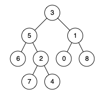
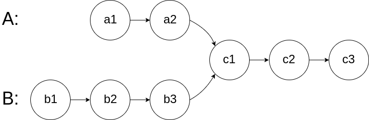

## Querying a Binary Search Tree

### LeetCode

Serialization

- 297.Serialize and Deserialize Binary Tree
- 700.Search in a Binary Search Tree

Lowest Common Ancestor

- 235.Lowest Common Ancestor of a Binary Search Tree
- 236.Lowest Common Ancestor of a Binary Tree
- 1644.Lowest Common Ancestor of a Binary Tree II
- 1650.Lowest Common Ancestor of a Binary Tree III
- 1676.Lowest Common Ancestor of a Binary Tree IV

Trie

- 208.Implement Trie (Prefix Tree)
- 211.Design Add and Search Words Data Structure
- 648.Replace Words
- 677.Map Sum Pairs
- 1804.Implement Trie II (Prefix Tree)

### Serialization

#### 297. Serialize and Deserialize Binary Tree

Serialization is the process of converting a data structure or object into a sequence of bits so that it can be stored in a file or memory buffer, or transmitted across a network connection link to be reconstructed later in the same or another computer environment.

Design an algorithm to serialize and deserialize a binary tree. There is no restriction on how your serialization/deserialization algorithm should work. You just need to ensure that a binary tree can be serialized to a string and this string can be deserialized to the original tree structure.

Clarification: The input/output format is the same as how LeetCode serializes a binary tree. You do not necessarily need to follow this format, so please be creative and come up with different approaches yourself.

 

Example 1:


```
Input: root = [1,2,3,null,null,4,5]
Output: [1,2,3,null,null,4,5]
```

Example 2:
```
Input: root = []
Output: []
```

Constraints:
- The number of nodes in the tree is in the range [0, 104].
- -1000 <= Node.val <= 1000

Preorder Solution
```
/*
 * Author @ LBLD
 * 1/5/2023
 */

/**
 * Definition for a binary tree node.
 * public class TreeNode {
 *     int val;
 *     TreeNode left;
 *     TreeNode right;
 *     TreeNode(int x) { val = x; }
 * }
 */
public class Codec {

    private String SEP = ",";
    private String NULL = "#";

    // Encodes a tree to a single string.
    public String serialize(TreeNode root) {
        StringBuilder sb = new StringBuilder();
        serialize(root, sb);
        return sb.toString();
    }

    // helper function, do preorder traverse
    public void serialize(TreeNode root, StringBuilder sb) {
        if (root == null) {
            sb.append(NULL).append(SEP);
            return;
        }

        sb.append(root.val).append(SEP);

        serialize(root.left, sb);
        serialize(root.right, sb);
    }

    // Decodes your encoded data to tree.
    TreeNode deserialize(String data) {
        LinkedList<String> nodes = new LinkedList<>();
        for (String s : data.split(SEP)) {
            nodes.addLast(s);
        }
        return deserialize(nodes);
    }

    // helper function, to build a binary search tree
    TreeNode deserialize(LinkedList<String> nodes) {
        if (nodes.isEmpty()) return null;

        String first = nodes.removeFirst();
        if (first.equals(NULL)) return null;
        TreeNode root = new TreeNode(Integer.parseInt(first));

        root.left = deserialize(nodes);
        root.right = deserialize(nodes);

        return root;
    }
}

// Your Codec object will be instantiated and called as such:
// Codec ser = new Codec();
// Codec deser = new Codec();
// TreeNode ans = deser.deserialize(ser.serialize(root));
```

Postorder Solution
***We need to deal with the last element when deserialization***
```
/* 
 * Author @ LBLD
 * 1/5/2023
 */

/**
 * Definition for a binary tree node.
 * public class TreeNode {
 *     int val;
 *     TreeNode left;
 *     TreeNode right;
 *     TreeNode(int x) { val = x; }
 * }
 */
public class Codec {

    private String SEP = ",";
    private String NULL = "#";

    // Encodes a tree to a single string.
    public String serialize(TreeNode root) {
        StringBuilder sb = new StringBuilder();
        serialize(root, sb);
        return sb.toString();
    }

    // helper function, do preorder traverse
    public void serialize(TreeNode root, StringBuilder sb) {
        if (root == null) {
            sb.append(NULL).append(SEP);
            return;
        }

        serialize(root.left, sb);
        serialize(root.right, sb);

        sb.append(root.val).append(SEP);
    }

    // Decodes your encoded data to tree.
    public TreeNode deserialize(String data) {
        LinkedList<String> nodes = new LinkedList<>();
        for (String s : data.split(SEP)) {
            nodes.addLast(s);
        }
        return deserialize(nodes);
    }

    // helper function, to build a binary search tree
    public TreeNode deserialize(LinkedList<String> nodes) {
        if (nodes.isEmpty()) return null;

        String last = nodes.removeLast();
        if (last.equals(NULL)) return null;
        TreeNode root = new TreeNode(Integer.parseInt(last));
        
        root.right = deserialize(nodes);
        root.left = deserialize(nodes);

        return root;
    }
}

// Your Codec object will be instantiated and called as such:
// Codec ser = new Codec();
// Codec deser = new Codec();
// TreeNode ans = deser.deserialize(ser.serialize(root));
```

Layers Iteration Solution
```
/*
 * Author @ LBLD
 * 1/5/2023
 */
/**
 * Definition for a binary tree node.
 * public class TreeNode {
 *     int val;
 *     TreeNode left;
 *     TreeNode right;
 *     TreeNode(int x) { val = x; }
 * }
 */
public class Codec {

    private String SEP = ",";
    private String NULL = "#";

    // Encodes a tree to a single string.
    public String serialize(TreeNode root) {
        if (root == null) return "";
        StringBuilder sb = new StringBuilder();

        Queue<TreeNode> q = new LinkedList<>();
        q.offer(root);

        while (!q.isEmpty()) {
            TreeNode cur = q.poll();

            if (cur == null) {
                sb.append(NULL).append(SEP);
                continue;
            }
            sb.append(cur.val).append(SEP);

            q.offer(cur.left);
            q.offer(cur.right);
        }

        return sb.toString();
    }

    // Decodes your encoded data to tree.
    public TreeNode deserialize(String data) {
        if (data.isEmpty()) return null;
        String[] nodes = data.split(SEP);

        TreeNode root = new TreeNode(Integer.parseInt(nodes[0]));

        Queue<TreeNode> q = new LinkedList<>();
        q.offer(root);

        for (int i = 1; i < nodes.length; ) {
            TreeNode parent = q.poll();

            String left = nodes[i++];
            if (!left.equals(NULL)) {
                parent.left = new TreeNode(Integer.parseInt(left));
                q.offer(parent.left);
            } else {
                parent.left = null;
            }
            
            String right = nodes[i++];
            if (!right.equals(NULL)) {
                parent.right = new TreeNode(Integer.parseInt(right));
                q.offer(parent.right);
            } else {
                parent.right = null;
            }
        }
        return root;
    }
}

// Your Codec object will be instantiated and called as such:
// Codec ser = new Codec();
// Codec deser = new Codec();
// TreeNode ans = deser.deserialize(ser.serialize(root));
```

#### 700. Search in a Binary Search Tree

You are given the root of a binary search tree (BST) and an integer val.

Find the node in the BST that the node's value equals val and return the subtree rooted with that node. If such a node does not exist, return null.

 
Example 1:


```
Input: root = [4,2,7,1,3], val = 2
Output: [2,1,3]
```

Example 2:


```
Input: root = [4,2,7,1,3], val = 5
Output: []
``` 

Constraints:

- The number of nodes in the tree is in the range [1, 5000].
- 1 <= Node.val <= 107
- root is a binary search tree.
- 1 <= val <= 107

Solution

```
/*
 * 1/24/2023
 */

/**
 * Definition for a binary tree node.
 * public class TreeNode {
 *     int val;
 *     TreeNode left;
 *     TreeNode right;
 *     TreeNode() {}
 *     TreeNode(int val) { this.val = val; }
 *     TreeNode(int val, TreeNode left, TreeNode right) {
 *         this.val = val;
 *         this.left = left;
 *         this.right = right;
 *     }
 * }
 */
class Solution {
    TreeNode searchBST(TreeNode root, int target) {

        if (root == null) {
            return null;
        }

        // serach left sub-tree
        if (root.val > target) {
            return searchBST(root.left, target);
        }

        // search right sub-tree
        if (root.val < target) {
            return searchBST(root.right, target);
        }
        return root;
    }

}

```

### Lowest Common Ancestor

#### 235. Lowest Common Ancestor of a Binary Search Tree
Given a binary search tree (BST), find the lowest common ancestor (LCA) node of two given nodes in the BST.

According to the definition of LCA on Wikipedia: “The lowest common ancestor is defined between two nodes p and q as the lowest node in T that has both p and q as descendants (where we allow a node to be a descendant of itself).”

 

Example 1:


```
Input: root = [6,2,8,0,4,7,9,null,null,3,5], p = 2, q = 8
Output: 6
Explanation: The LCA of nodes 2 and 8 is 6.
```

Example 2:


```
Input: root = [6,2,8,0,4,7,9,null,null,3,5], p = 2, q = 4
Output: 2
Explanation: The LCA of nodes 2 and 4 is 2, since a node can be a descendant of itself according to the LCA definition.
```

Example 3:

```
Input: root = [2,1], p = 2, q = 1
Output: 2
``` 

Constraints:

- The number of nodes in the tree is in the range [2, 105].
- -109 <= Node.val <= 109
- All Node.val are unique.
- p != q
- p and q will exist in the BST.

```
/*
 * 1/31/2023
 */

/**
 * Definition for a binary tree node.
 * public class TreeNode {
 *     int val;
 *     TreeNode left;
 *     TreeNode right;
 *     TreeNode(int x) { val = x; }
 * }
 */

class Solution {
    TreeNode lowestCommonAncestor(TreeNode root, TreeNode p, TreeNode q) {
        // set val1 as smaller one, and set val2 as bigger one
        int val1 = Math.min(p.val, q.val);
        int val2 = Math.max(p.val, q.val);
        return find(root, val1, val2);
    }

    // make use of BST property
    TreeNode find(TreeNode root, int val1, int val2) {

        // base case
        if (root == null) {
            return null;
        }

        // go to left child
        if (root.val > val2) {
            return find(root.left, val1, val2);
        }

        // go to right child
        if (root.val < val1) {
            return find(root.right, val1, val2);
        }
        
        return root;
    }
}
```

#### 236. Lowest Common Ancestor of a Binary Tree

Given a binary tree, find the lowest common ancestor (LCA) of two given nodes in the tree.

According to the definition of LCA on Wikipedia: “The lowest common ancestor is defined between two nodes p and q as the lowest node in T that has both p and q as descendants (where we allow a node to be a descendant of itself).”

 

Example 1:


```
Input: root = [3,5,1,6,2,0,8,null,null,7,4], p = 5, q = 1
Output: 3
Explanation: The LCA of nodes 5 and 1 is 3.
```

Example 2:


```
Input: root = [3,5,1,6,2,0,8,null,null,7,4], p = 5, q = 4
Output: 5
Explanation: The LCA of nodes 5 and 4 is 5, since a node can be a descendant of itself according to the LCA definition.
```

Example 3:

```
Input: root = [1,2], p = 1, q = 2
Output: 1
``` 

Constraints:

- The number of nodes in the tree is in the range [2, 105].
- -109 <= Node.val <= 109
- All Node.val are unique.
- p != q
- p and q will exist in the tree.

```
/*
 * 1/31/2023
 */

/**
 * Definition for a binary tree node.
 * public class TreeNode {
 *     int val;
 *     TreeNode left;
 *     TreeNode right;
 *     TreeNode(int x) { val = x; }
 * }
 */
class Solution {
    TreeNode lowestCommonAncestor(TreeNode root, TreeNode p, TreeNode q) {
        return find(root, p.val, q.val);
    }

    TreeNode find(TreeNode root, int val1, int val2) {
        if (root == null) {
            return null;
        }

        // pre-order traverse
        if (root.val == val1 || root.val == val2) {
            return root;
        }

        TreeNode left = find(root.left, val1, val2);
        TreeNode right = find(root.right, val1, val2);

        // both left and right has one of the target
        if (left != null && right != null) {
            return root;
        }

        return left != null ? left : right;
    }
}
```

#### 1644. Lowest Common Ancestor of a Binary Tree II

Given the root of a binary tree, return the lowest common ancestor (LCA) of two given nodes, p and q. If either node p or q does not exist in the tree, return null. All values of the nodes in the tree are unique.

According to the definition of LCA on Wikipedia: "The lowest common ancestor of two nodes p and q in a binary tree T is the lowest node that has both p and q as descendants (where we allow a node to be a descendant of itself)". A descendant of a node x is a node y that is on the path from node x to some leaf node.

 

Example 1:


```
Input: root = [3,5,1,6,2,0,8,null,null,7,4], p = 5, q = 1
Output: 3
Explanation: The LCA of nodes 5 and 1 is 3.
```

Example 2:


```
Input: root = [3,5,1,6,2,0,8,null,null,7,4], p = 5, q = 4
Output: 5
Explanation: The LCA of nodes 5 and 4 is 5. A node can be a descendant of itself according to the definition of LCA.
```

Example 3:


```
Input: root = [3,5,1,6,2,0,8,null,null,7,4], p = 5, q = 10
Output: null
Explanation: Node 10 does not exist in the tree, so return null.
``` 

Constraints:

- The number of nodes in the tree is in the range [1, 104].
- -109 <= Node.val <= 109
- All Node.val are unique.
- p != q

```
/*
 * 1/31/2023
 */

/**
 * Definition for a binary tree node.
 * public class TreeNode {
 *     int val;
 *     TreeNode left;
 *     TreeNode right;
 *     TreeNode(int x) { val = x; }
 * }
 */
class Solution {

    private boolean foundP = false, foundQ = false;

    TreeNode lowestCommonAncestor(TreeNode root, TreeNode p, TreeNode q) {

        TreeNode res = find(root, p.val, q.val);

        if (!foundP || !foundQ) {
            return null;
        }
        
        return res;
    }

    TreeNode find(TreeNode root, int val1, int val2) {
        if (root == null) {
            return null;
        }

        TreeNode left = find(root.left, val1, val2);
        TreeNode right = find(root.right, val1, val2);

        // post-order
        if (left != null && right != null) {
            return root;
        }

        // if any one found
        if (root.val == val1 || root.val == val2) {
            if (root.val == val1) foundP = true;
            if (root.val == val2) foundQ = true;
            return root;
        }

        // if found -> value, if not -> null
        return left != null ? left : right;
    }
}
```

#### 1650. Lowest Common Ancestor of a Binary Tree III

Given two nodes of a binary tree p and q, return their lowest common ancestor (LCA).

Each node will have a reference to its parent node. The definition for Node is below:
```
class Node {
    public int val;
    public Node left;
    public Node right;
    public Node parent;
}
```

According to the definition of LCA on Wikipedia: "The lowest common ancestor of two nodes p and q in a tree T is the lowest node that has both p and q as descendants (where we allow a node to be a descendant of itself)."

 

Example 1:



```
Input: root = [3,5,1,6,2,0,8,null,null,7,4], p = 5, q = 1
Output: 3
Explanation: The LCA of nodes 5 and 1 is 3.
```

Example 2:


```
Input: root = [3,5,1,6,2,0,8,null,null,7,4], p = 5, q = 4
Output: 5
Explanation: The LCA of nodes 5 and 4 is 5 since a node can be a descendant of itself according to the LCA definition.
```

Example 3:

```
Input: root = [1,2], p = 1, q = 2
Output: 1
``` 

Constraints:

- The number of nodes in the tree is in the range [2, 105].
- -109 <= Node.val <= 109
- All Node.val are unique.
- p != q
- p and q exist in the tree.

Idea:


```
/*
 * 1/31/2023
 */

/*
// Definition for a Node.
class Node {
    public int val;
    public Node left;
    public Node right;
    public Node parent;
};
*/

class Solution {

    // idea, two nodes should meet at the LCA if they move the same distance
    public Node lowestCommonAncestor(Node p, Node q) {

        Node a = p, b = q;

        while (a != b) {
            // move a
            if (a == null) {
                a = q;
            }
            else {
                a = a.parent;
            };

            // move b
            if (b == null) {
                b = p;
            }
            else {
                b = b.parent;
            };
        }
        return a;
    }
}
```

#### 1676. Lowest Common Ancestor of a Binary Tree IV

Given the root of a binary tree and an array of TreeNode objects nodes, return the lowest common ancestor (LCA) of all the nodes in nodes. All the nodes will exist in the tree, and all values of the tree's nodes are unique.

Extending the definition of LCA on Wikipedia: "The lowest common ancestor of n nodes p1, p2, ..., pn in a binary tree T is the lowest node that has every pi as a descendant (where we allow a node to be a descendant of itself) for every valid i". A descendant of a node x is a node y that is on the path from node x to some leaf node.

 
Example 1:


```
Input: root = [3,5,1,6,2,0,8,null,null,7,4], nodes = [4,7]
Output: 2
Explanation: The lowest common ancestor of nodes 4 and 7 is node 2.
```

Example 2:


```
Input: root = [3,5,1,6,2,0,8,null,null,7,4], nodes = [1]
Output: 1
Explanation: The lowest common ancestor of a single node is the node itself.
```

Example 3:


```
Input: root = [3,5,1,6,2,0,8,null,null,7,4], nodes = [7,6,2,4]
Output: 5
Explanation: The lowest common ancestor of the nodes 7, 6, 2, and 4 is node 5.
``` 

Constraints:

- The number of nodes in the tree is in the range [1, 104].
- -109 <= Node.val <= 109
- All Node.val are unique.
- All nodes[i] will exist in the tree.
- All nodes[i] are distinct.

```
/*
 * 1/31/2023
 */

/**
 * Definition for a binary tree node.
 * public class TreeNode {
 *     int val;
 *     TreeNode left;
 *     TreeNode right;
 *     TreeNode(int x) { val = x; }
 * }
 */
class Solution {
    TreeNode lowestCommonAncestor(TreeNode root, TreeNode[] nodes) {
        // store nodes in HashSet
        HashSet<Integer> values = new HashSet<>();
        for (TreeNode node : nodes) {
            values.add(node.val);
        }

        return find(root, values);
    }

    TreeNode find(TreeNode root, HashSet<Integer> values) {
        if (root == null) {
            return null;
        }
        // preorder traverse
        if (values.contains(root.val)){
            return root;
        }

        TreeNode left = find(root.left, values);
        TreeNode right = find(root.right, values);
        // if both child valid, then the current is the answer
        if (left != null && right != null) {
            return root;
        }

        return left != null ? left : right;
    }
}
```

### Trie

#### TrieMap - Sample
```
class TrieMap<V> {
    // ASCII 码个数
    private static final int R = 256;
    // 当前存在 Map 中的键值对个数
    private int size = 0;
    // Trie 树的根节点
    private TrieNode<V> root = null;

    private static class TrieNode<V> {
        V val = null;
        TrieNode<V>[] children = new TrieNode[R];
    }

    /***** 增/改 *****/

    // 在 map 中添加或修改键值对
    public void put(String key, V val) {
        if (!containsKey(key)) {
            // 新增键值对
            size++;
        }
        // 需要一个额外的辅助函数，并接收其返回值
        root = put(root, key, val, 0);
    }

    // 定义：向以 node 为根的 Trie 树中插入 key[i..]，返回插入完成后的根节点
    private TrieNode<V> put(TrieNode<V> node, String key, V val, int i) {
        if (node == null) {
            // 如果树枝不存在，新建
            node = new TrieNode<>();
        }
        if (i == key.length()) {
            // key 的路径已插入完成，将值 val 存入节点
            node.val = val;
            return node;
        }
        char c = key.charAt(i);
        // 递归插入子节点，并接收返回值
        node.children[c] = put(node.children[c], key, val, i + 1);
        return node;
    }

    /***** 删 *****/

    // 在 Map 中删除 key
    public void remove(String key) {
        if (!containsKey(key)) {
            return;
        }
        // 递归修改数据结构要接收函数的返回值
        root = remove(root, key, 0);
        size--;
    }

    // 定义：在以 node 为根的 Trie 树中删除 key[i..]，返回删除后的根节点
    private TrieNode<V> remove(TrieNode<V> node, String key, int i) {
        if (node == null) {
            return null;
        }
        if (i == key.length()) {
            // 找到了 key 对应的 TrieNode，删除 val
            node.val = null;
        } else {
            char c = key.charAt(i);
            // 递归去子树进行删除
            node.children[c] = remove(node.children[c], key, i + 1);
        }
        // 后序位置，递归路径上的节点可能需要被清理
        if (node.val != null) {
            // 如果该 TireNode 存储着 val，不需要被清理
            return node;
        }
        // 检查该 TrieNode 是否还有后缀
        for (int c = 0; c < R; c++) {
            if (node.children[c] != null) {
                // 只要存在一个子节点（后缀树枝），就不需要被清理
                return node;
            }
        }
        // 既没有存储 val，也没有后缀树枝，则该节点需要被清理
        return null;
    }

    /***** 查 *****/

    // 搜索 key 对应的值，不存在则返回 null
    public V get(String key) {
        // 从 root 开始搜索 key
        TrieNode<V> x = getNode(root, key);
        if (x == null || x.val == null) {
            // x 为空或 x 的 val 字段为空都说明 key 没有对应的值
            return null;
        }
        return x.val;
    }

    // 判断 key 是否存在在 Map 中
    public boolean containsKey(String key) {
        return get(key) != null;
    }

    // 判断是和否存在前缀为 prefix 的键
    public boolean hasKeyWithPrefix(String prefix) {
        // 只要能找到一个节点，就是存在前缀
        return getNode(root, prefix) != null;
    }

    // 在所有键中寻找 query 的最短前缀
    public String shortestPrefixOf(String query) {
        TrieNode<V> p = root;
        // 从节点 node 开始搜索 key
        for (int i = 0; i < query.length(); i++) {
            if (p == null) {
                // 无法向下搜索
                return "";
            }
            if (p.val != null) {
                // 找到一个键是 query 的前缀
                return query.substring(0, i);
            }
            // 向下搜索
            char c = query.charAt(i);
            p = p.children[c];
        }

        if (p != null && p.val != null) {
            // 如果 query 本身就是一个键
            return query;
        }
        return "";
    }

    // 在所有键中寻找 query 的最长前缀
    public String longestPrefixOf(String query) {
        TrieNode<V> p = root;
        // 记录前缀的最大长度
        int max_len = 0;

        // 从节点 node 开始搜索 key
        for (int i = 0; i < query.length(); i++) {
            if (p == null) {
                // 无法向下搜索
                break;
            }
            if (p.val != null) {
                // 找到一个键是 query 的前缀，更新前缀的最大长度
                max_len = i;
            }
            // 向下搜索
            char c = query.charAt(i);
            p = p.children[c];
        }

        if (p != null && p.val != null) {
            // 如果 query 本身就是一个键
            return query;
        }
        return query.substring(0, max_len);
    }

    // 搜索前缀为 prefix 的所有键
    public List<String> keysWithPrefix(String prefix) {
        List<String> res = new LinkedList<>();
        // 找到匹配 prefix 在 Trie 树中的那个节点
        TrieNode<V> x = getNode(root, prefix);
        if (x == null) {
            return res;
        }
        // DFS 遍历以 x 为根的这棵 Trie 树
        traverse(x, new StringBuilder(prefix), res);
        return res;
    }

    // 遍历以 node 节点为根的 Trie 树，找到所有键
    private void traverse(TrieNode<V> node, StringBuilder path, List<String> res) {
        if (node == null) {
            // 到达 Trie 树底部叶子结点
            return;
        }

        if (node.val != null) {
            // 找到一个 key，添加到结果列表中
            res.add(path.toString());
        }

        // 回溯算法遍历框架
        for (char c = 0; c < R; c++) {
            // 做选择
            path.append(c);
            traverse(node.children[c], path, res);
            // 撤销选择
            path.deleteCharAt(path.length() - 1);
        }
    }

    // 通配符 . 匹配任意字符
    public List<String> keysWithPattern(String pattern) {
        List<String> res = new LinkedList<>();
        traverse(root, new StringBuilder(), pattern, 0, res);
        return res;
    }

    // 遍历函数，尝试在「以 node 为根的 Trie 树中」匹配 pattern[i..]
    private void traverse(TrieNode<V> node, StringBuilder path, String pattern, int i, List<String> res) {
        if (node == null) {
            // 树枝不存在，即匹配失败
            return;
        }
        if (i == pattern.length()) {
            // pattern 匹配完成
            if (node.val != null) {
                // 如果这个节点存储着 val，则找到一个匹配的键
                res.add(path.toString());
            }
            return;
        }
        char c = pattern.charAt(i);
        if (c == '.') {
            // pattern[i] 是通配符，可以变化成任意字符
            // 多叉树（回溯算法）遍历框架
            for (char j = 0; j < R; j++) {
                path.append(j);
                traverse(node.children[j], path, pattern, i + 1, res);
                path.deleteCharAt(path.length() - 1);
            }
        } else {
            // pattern[i] 是普通字符 c
            path.append(c);
            traverse(node.children[c], path, pattern, i + 1, res);
            path.deleteCharAt(path.length() - 1);
        }
    }

    // 判断是和否存在前缀为 prefix 的键
    public boolean hasKeyWithPattern(String pattern) {
        // 从 root 节点开始匹配 pattern[0..]
        return hasKeyWithPattern(root, pattern, 0);
    }

    // 函数定义：从 node 节点开始匹配 pattern[i..]，返回是否成功匹配
    private boolean hasKeyWithPattern(TrieNode<V> node, String pattern, int i) {
        if (node == null) {
            // 树枝不存在，即匹配失败
            return false;
        }
        if (i == pattern.length()) {
            // 模式串走到头了，看看匹配到的是否是一个键
            return node.val != null;
        }
        char c = pattern.charAt(i);
        // 没有遇到通配符
        if (c != '.') {
            // 从 node.children[c] 节点开始匹配 pattern[i+1..]
            return hasKeyWithPattern(node.children[c], pattern, i + 1);
        }
        // 遇到通配符
        for (int j = 0; j < R; j++) {
            // pattern[i] 可以变化成任意字符，尝试所有可能，只要遇到一个匹配成功就返回
            if (hasKeyWithPattern(node.children[j], pattern, i + 1)) {
                return true;
            }
        }
        // 都没有匹配
        return false;
    }

    // 从节点 node 开始搜索 key，如果存在返回对应节点，否则返回 null
    private TrieNode<V> getNode(TrieNode<V> node, String key) {
        TrieNode<V> p = node;
        // 从节点 node 开始搜索 key
        for (int i = 0; i < key.length(); i++) {
            if (p == null) {
                // 无法向下搜索
                return null;
            }
            // 向下搜索
            char c = key.charAt(i);
            p = p.children[c];
        }
        return p;
    }

    public int size() {
        return size;
    }
}
```

#### TrieSet - Sample
```
class TrieSet {
    // 底层用一个 TrieMap，键就是 TrieSet，值仅仅起到占位的作用
    // 值的类型可以随便设置，我参考 Java 标准库设置成 Object
    private final TrieMap<Object> map = new TrieMap<>();

    /***** 增 *****/

    // 在集合中添加元素 key
    public void add(String key) {
        map.put(key, new Object());
    }

    /***** 删 *****/

    // 从集合中删除元素 key
    public void remove(String key) {
        map.remove(key);
    }

    /***** 查 *****/

    // 判断元素 key 是否存在集合中
    public boolean contains(String key) {
        return map.containsKey(key);
    }

    // 在集合中寻找 query 的最短前缀
    public String shortestPrefixOf(String query) {
        return map.shortestPrefixOf(query);
    }

    // 在集合中寻找 query 的最长前缀
    public String longestPrefixOf(String query) {
        return map.longestPrefixOf(query);
    }

    // 在集合中搜索前缀为 prefix 的所有元素
    public List<String> keysWithPrefix(String prefix) {
        return map.keysWithPrefix(prefix);
    }

    // 判断集合中是否存在前缀为 prefix 的元素
    public boolean hasKeyWithPrefix(String prefix) {
        return map.hasKeyWithPrefix(prefix);
    }

    // 通配符 . 匹配任意字符，返回集合中匹配 pattern 的所有元素
    public List<String> keysWithPattern(String pattern) {
        return map.keysWithPattern(pattern);
    }

    // 通配符 . 匹配任意字符，判断集合中是否存在匹配 pattern 的元素
    public boolean hasKeyWithPattern(String pattern) {
        return map.hasKeyWithPattern(pattern);
    }

    // 返回集合中元素的个数
    public int size() {
        return map.size();
    }
}
```

#### 208. Implement Trie (Prefix Tree)

A trie (pronounced as "try") or prefix tree is a tree data structure used to efficiently store and retrieve keys in a dataset of strings. There are various applications of this data structure, such as autocomplete and spellchecker.

Implement the Trie class:

- Trie() Initializes the trie object.
- void insert(String word) Inserts the string word into the trie.
- boolean search(String word) Returns true if the string word is in the trie (i.e., was inserted before), and false otherwise.
- boolean startsWith(String prefix) Returns true if there is a previously inserted string word that has the prefix prefix, and false otherwise.
 

Example 1:

```
Input
["Trie", "insert", "search", "search", "startsWith", "insert", "search"]
[[], ["apple"], ["apple"], ["app"], ["app"], ["app"], ["app"]]
Output
[null, null, true, false, true, null, true]

Explanation
Trie trie = new Trie();
trie.insert("apple");
trie.search("apple");   // return True
trie.search("app");     // return False
trie.startsWith("app"); // return True
trie.insert("app");
trie.search("app");     // return True
```

Constraints:

- 1 <= word.length, prefix.length <= 2000
- word and prefix consist only of lowercase English letters.
- At most 3 * 104 calls in total will be made to insert, search, and startsWith.

Solution:
```
/*
 * 2/8/2023
 */

class Trie {
    // 直接封装 TrieSet
    TrieSet set = new TrieSet();

    // 插入一个元素
    public void insert(String word) {
        set.add(word);
    }

    // 判断元素是否在集合中
    public boolean search(String word) {
        return set.contains(word);
    }

    // 判断集合中是否有前缀为 prefix 的元素
    public boolean startsWith(String prefix) {
        return set.hasKeyWithPrefix(prefix);
    }
}

class TrieSet {}

class TrieMap {}
```

#### 211. Design Add and Search Words Data Structure

Design a data structure that supports adding new words and finding if a string matches any previously added string.

Implement the WordDictionary class:

WordDictionary() Initializes the object.
void addWord(word) Adds word to the data structure, it can be matched later.
bool search(word) Returns true if there is any string in the data structure that matches word or false otherwise. word may contain dots '.' where dots can be matched with any letter.
 

Example:

```
Input
["WordDictionary","addWord","addWord","addWord","search","search","search","search"]
[[],["bad"],["dad"],["mad"],["pad"],["bad"],[".ad"],["b.."]]
Output
[null,null,null,null,false,true,true,true]

Explanation
WordDictionary wordDictionary = new WordDictionary();
wordDictionary.addWord("bad");
wordDictionary.addWord("dad");
wordDictionary.addWord("mad");
wordDictionary.search("pad"); // return False
wordDictionary.search("bad"); // return True
wordDictionary.search(".ad"); // return True
wordDictionary.search("b.."); // return True
```

Constraints:

- 1 <= word.length <= 25
- word in addWord consists of lowercase English letters.
- word in search consist of '.' or lowercase English letters.
- There will be at most 3 dots in word for search queries.
- At most 104 calls will be made to addWord and search.

Solution - TLE:
```
/*
 * 2/8/2023
 */

class WordDictionary {
    TrieSet set = new TrieSet();

    // 在 TrieSet 中添加元素
    public void addWord(String word) {
        set.add(word);
    }

    // 通配符匹配元素
    public boolean search(String word) {
        return set.hasKeyWithPattern(word);
    }
}

class TrieSet { /* 见上文 */ }

class TrieMap { /* 见上文 */ }
```

#### 648. Replace Words

In English, we have a concept called root, which can be followed by some other word to form another longer word - let's call this word successor. For example, when the root "an" is followed by the successor word "other", we can form a new word "another".

Given a dictionary consisting of many roots and a sentence consisting of words separated by spaces, replace all the successors in the sentence with the root forming it. If a successor can be replaced by more than one root, replace it with the root that has the shortest length.

Return the sentence after the replacement.


Example 1:

```
Input: dictionary = ["cat","bat","rat"], sentence = "the cattle was rattled by the battery"
Output: "the cat was rat by the bat"
```

Example 2:

```
Input: dictionary = ["a","b","c"], sentence = "aadsfasf absbs bbab cadsfafs"
Output: "a a b c"
``` 

Constraints:

- 1 <= dictionary.length <= 1000
- 1 <= dictionary[i].length <= 100
- dictionary[i] consists of only lower-case letters.
- 1 <= sentence.length <= 106
- sentence consists of only lower-case letters and spaces.
- The number of words in sentence is in the range [1, 1000]
- The length of each word in sentence is in the range [1, 1000]
- Every two consecutive words in sentence will be separated by exactly one space.
- sentence does not have leading or trailing spaces.

Solution:
```
/*
 * 2/8/2023
 */

String replaceWords(List<String> dict, String sentence) {
    // 先将词根都存入 TrieSet
    TrieSet set = new TrieSet();
    for (String key : dict) {
        set.add(key);
    }
    StringBuilder sb = new StringBuilder();
    String[] words = sentence.split(" ");
    // 处理句子中的单词
    for (int i = 0; i < words.length; i++) {
        // 在 Trie 树中搜索最短词根（最短前缀）
        String prefix = set.shortestPrefixOf(words[i]);
        if (!prefix.isEmpty()) {
            // 如果搜索到了，改写为词根
            sb.append(prefix);
        } else {
            // 否则，原样放回
            sb.append(words[i]);
        }

        if (i != words.length - 1) {
            // 添加单词之间的空格
            sb.append(' ');
        }
    }

    return sb.toString();
}

class TrieSet { /* 见上文 */ }

class TrieMap { /* 见上文 */ }
```

#### 677. Map Sum Pairs

Design a map that allows you to do the following:

- Maps a string key to a given value.
- Returns the sum of the values that have a key with a prefix equal to a given string.

Implement the MapSum class:

- MapSum() Initializes the MapSum object.
- void insert(String key, int val) Inserts the key-val pair into the map. If the key already existed, the original key-value pair will be overridden to the new one.
- int sum(string prefix) Returns the sum of all the pairs' value whose key starts with the prefix.
 

Example 1:

```
Input
["MapSum", "insert", "sum", "insert", "sum"]
[[], ["apple", 3], ["ap"], ["app", 2], ["ap"]]
Output
[null, null, 3, null, 5]

Explanation
MapSum mapSum = new MapSum();
mapSum.insert("apple", 3);  
mapSum.sum("ap");           // return 3 (apple = 3)
mapSum.insert("app", 2);    
mapSum.sum("ap");           // return 5 (apple + app = 3 + 2 = 5)
``` 

Constraints:

- 1 <= key.length, prefix.length <= 50
- key and prefix consist of only lowercase English letters.
- 1 <= val <= 1000
- At most 50 calls will be made to insert and sum.

Solutions:

```
/*
 * 2/8/2023
 */

class MapSum {
    // 封装我们实现的 TrieMap
    TrieMap<Integer> map = new TrieMap<>();

    // 插入键值对
    public void insert(String key, int val) {
        map.put(key, val);
    }

    // 累加所有前缀为 prefix 的键的值
    public int sum(String prefix) {
        List<String> keys = map.keysWithPrefix(prefix);
        int res = 0;
        for (String key : keys) {
            res += map.get(key);
        }
        return res;
    }
}

class TrieMap { /* 见上文 */ }
```

#### 1804. Implement Trie II (Prefix Tree)

A trie (pronounced as "try") or prefix tree is a tree data structure used to efficiently store and retrieve keys in a dataset of strings. There are various applications of this data structure, such as autocomplete and spellchecker.

Implement the Trie class:

Trie() Initializes the trie object.
void insert(String word) Inserts the string word into the trie.
int countWordsEqualTo(String word) Returns the number of instances of the string word in the trie.
int countWordsStartingWith(String prefix) Returns the number of strings in the trie that have the string prefix as a prefix.
void erase(String word) Erases the string word from the trie.
 

Example 1:

```
Input
["Trie", "insert", "insert", "countWordsEqualTo", "countWordsStartingWith", "erase", "countWordsEqualTo", "countWordsStartingWith", "erase", "countWordsStartingWith"]
[[], ["apple"], ["apple"], ["apple"], ["app"], ["apple"], ["apple"], ["app"], ["apple"], ["app"]]
Output
[null, null, null, 2, 2, null, 1, 1, null, 0]

Explanation
Trie trie = new Trie();
trie.insert("apple");               // Inserts "apple".
trie.insert("apple");               // Inserts another "apple".
trie.countWordsEqualTo("apple");    // There are two instances of "apple" so return 2.
trie.countWordsStartingWith("app"); // "app" is a prefix of "apple" so return 2.
trie.erase("apple");                // Erases one "apple".
trie.countWordsEqualTo("apple");    // Now there is only one instance of "apple" so return 1.
trie.countWordsStartingWith("app"); // return 1
trie.erase("apple");                // Erases "apple". Now the trie is empty.
trie.countWordsStartingWith("app"); // return 0
```

Constraints:

- 1 <= word.length, prefix.length <= 2000
- word and prefix consist only of lowercase English letters.
- At most 3 * 104 calls in total will be made to insert, countWordsEqualTo, countWordsStartingWith, and erase.
- It is guaranteed that for any function call to erase, the string word will exist in the trie.

Solution:
```
/*
 * 2/8/2023
 */

class Trie {
    // 封装我们实现的 TrieMap
    TrieMap<Integer> map = new TrieMap<>();

    // 插入 word 并记录插入次数
    public void insert(String word) {
        if (!map.containsKey(word)) {
            map.put(word, 1);
        } else {
            map.put(word, map.get(word) + 1);
        }
    }

    // 查询 word 插入的次数
    public int countWordsEqualTo(String word) {
        if (!map.containsKey(word)) {
            return 0;
        }
        return map.get(word);
    }

    // 累加前缀为 prefix 的键的插入次数总和
    public int countWordsStartingWith(String prefix) {
        int res = 0;
        for (String key : map.keysWithPrefix(prefix)) {
            res += map.get(key);
        }
        return res;
    }

    // word 的插入次数减一
    public void erase(String word) {
        int freq = map.get(word);
        if (freq - 1 == 0) {
            map.remove(word);
        } else {
            map.put(word, freq - 1);
        }
    }
}

class TrieMap { /* 见上文 */ }
```