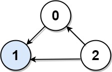
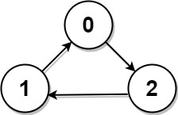

# Representations of graphs

## LeetCode
- 277.Find the Celebrity

### 277. Find the Celebrity

Suppose you are at a party with n people labeled from 0 to n - 1 and among them, there may exist one celebrity. The definition of a celebrity is that all the other n - 1 people know the celebrity, but the celebrity does not know any of them.

Now you want to find out who the celebrity is or verify that there is not one. You are only allowed to ask questions like: "Hi, A. Do you know B?" to get information about whether A knows B. You need to find out the celebrity (or verify there is not one) by asking as few questions as possible (in the asymptotic sense).

You are given a helper function bool knows(a, b) that tells you whether a knows b. Implement a function int findCelebrity(n). There will be exactly one celebrity if they are at the party.

Return the celebrity's label if there is a celebrity at the party. If there is no celebrity, return -1.

 

Example 1:



```
Input: graph = [[1,1,0],[0,1,0],[1,1,1]]
Output: 1
Explanation: There are three persons labeled with 0, 1 and 2. graph[i][j] = 1 means person i knows person j, otherwise graph[i][j] = 0 means person i does not know person j. The celebrity is the person labeled as 1 because both 0 and 2 know him but 1 does not know anybody.
```

Example 2:



```
Input: graph = [[1,0,1],[1,1,0],[0,1,1]]
Output: -1
Explanation: There is no celebrity.
```

Constraints:

- n == graph.length == graph[i].length
- 2 <= n <= 100
- graph[i][j] is 0 or 1.
- graph[i][i] == 1


#### Solution
```
/*
 * 2/7/2023
 */

/* The knows API is defined in the parent class Relation.
      boolean knows(int a, int b); */

public class Solution extends Relation {
    public int findCelebrity(int n) {
        // assume cand is the celebrity
        int cand = 0;
        for (int other = 1; other < n; other++) {
            if (!knows(other, cand) || knows(cand, other)) {
                // cand is not the celebrity
                // update cand with other
                cand = other;
            } else {
                // still use cand as the celebrity
            }
        }

        // final check the cand
        for (int other = 0; other < n; other++) {
            if (cand == other) continue;
            // invalid
            if (!knows(other, cand) || knows(cand, other)) {
                return -1;
            }
        }

        return cand;
    }
}
```