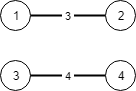

# Kruskal and Prim

## Algorithm Pattern
Firstly, let's have a look at Union-Find, we will use it to help us valid if our graph is a valid tree.
```aidl
class UF {
    private int count;
    private int[] parent;
    private int[] size;

    public UF(int n) {
        this.count = n;
        parent = new int[n];
        size = new int[n];
        for (int i = 0; i < n; i++) {
            parent[i] = i;
            size[i] = 1;
        }
    }

    public void union(int p, int q) {
        int rootP = find(p);
        int rootQ = find(q);
        if (rootP == rootQ)
            return;

        // balance
        if (size[rootP] > size[rootQ]) {
            parent[rootQ] = rootP;
            size[rootP] += size[rootQ];
        } else {
            parent[rootP] = rootQ;
            size[rootQ] += size[rootP];
        }
        
        count--;
    }

    public boolean connected(int p, int q) {
        int rootP = find(p);
        int rootQ = find(q);
        return rootP == rootQ;
    }

    private int find(int x) {
        while (parent[x] != x) {
            parent[x] = parent[parent[x]];
            x = parent[x];
        }
        return x;
    }

    public int count() {
        return count;
    }
}
```

## LeetCode
Kruskal
- 261.Graph Valid Tree
- 1135.Connecting Cities With Minimum Cost
- 1584.Min Cost to Connect All Points
Prim

### 261. Graph Valid Tree

You have a graph of n nodes labeled from 0 to n - 1. You are given an integer n and a list of edges where edges[i] = [ai, bi] indicates that there is an undirected edge between nodes ai and bi in the graph.

Return true if the edges of the given graph make up a valid tree, and false otherwise.

Example 1:


```
Input: n = 5, edges = [[0,1],[0,2],[0,3],[1,4]]
Output: true
```

Example 2:


```
Input: n = 5, edges = [[0,1],[1,2],[2,3],[1,3],[1,4]]
Output: false
```

Constraints:
- 1 <= n <= 2000
- 0 <= edges.length <= 5000
- edges[i].length == 2
- 0 <= ai, bi < n
- ai != bi
- There are no self-loops or repeated edges.

#### Solution
We could use Union-Find to check if two connected nodes be union already.

```aidl
/*
 * Author @ LBLD
 * 12-19-2022
 */

class Solution {

    boolean validTree(int n, int[][] edges) {
        // initialize the union-find
        UF uf = new UF(n);
        // connect two nodes connected by one edge
        for (int[] edge : edges) {
            int u = edge[0];
            int v = edge[1];
            // if these two nodes be union already
            if (uf.connected(u, v)) {
                return false;
            }
            // union these two nodes
            uf.union(u, v);
        }
        // check if only a single tree exists
        return uf.count() == 1;
    }

    class UF {
        private int count;
        private int[] parent;
        private int[] size;

        public UF(int n) {
            this.count = n;
            parent = new int[n];
            size = new int[n];
            for (int i = 0; i < n; i++) {
                parent[i] = i;
                size[i] = 1;
            }
        }

        public void union(int p, int q) {
            int rootP = find(p);
            int rootQ = find(q);
            if (rootP == rootQ)
                return;

            if (size[rootP] > size[rootQ]) {
                parent[rootQ] = rootP;
                size[rootP] += size[rootQ];
            } else {
                parent[rootP] = rootQ;
                size[rootQ] += size[rootP];
            }

            count--;
        }

        public boolean connected(int p, int q) {
            int rootP = find(p);
            int rootQ = find(q);
            return rootP == rootQ;
        }

        private int find(int x) {
            while (parent[x] != x) {
                parent[x] = parent[parent[x]];
                x = parent[x];
            }
            return x;
        }

        public int count() {
            return count;
        }
    }
}
```

### 1135. Connecting Cities With Minimum Cost

There are n cities labeled from 1 to n. You are given the integer n and an array connections where connections[i] = [xi, yi, costi] indicates that the cost of connecting city xi and city yi (bidirectional connection) is costi.

Return the minimum cost to connect all the n cities such that there is at least one path between each pair of cities. If it is impossible to connect all the n cities, return -1,

The cost is the sum of the connections' costs used.


Example 1:


```
Input: n = 3, connections = [[1,2,5],[1,3,6],[2,3,1]]
Output: 6
Explanation: Choosing any 2 edges will connect all cities so we choose the minimum 2.
```

Example 2:



```
Input: n = 4, connections = [[1,2,3],[3,4,4]]
Output: -1
Explanation: There is no way to connect all cities even if all edges are used.
```

Constraints:
- 1 <= n <= 104
- 1 <= connections.length <= 104
- connections[i].length == 3
- 1 <= xi, yi <= n
- xi != yi
- 0 <= costi <= 105

#### Idea
We have known how to check and get a tree from graph using Union-Find. But how could we reach the minimum cost tree?

One idea is to sort the edge and start with the least weight edge, actually greedy algorithm.

#### Solution
```aidl
/*
 * Author @ LBLD
 * 12-19-2022
 */
 
class Solution {
    int minimumCost(int n, int[][] connections) {
        // label start from 1
        UF uf = new UF(n + 1);
        // sort edge based on weight
        Arrays.sort(connections, (a, b) -> (a[2] - b[2]));
        // the minimum weight
        int mst = 0;
        // pick the minimum edge from sorted edge
        for (int[] edge : connections) {
            int u = edge[0];
            int v = edge[1];
            int weight = edge[2];
            // if cyclic edge
            if (uf.connected(u, v)) {
                continue;
            }
            
            mst += weight;
            uf.union(u, v);
        }
        // because node 0 won't be connected with tree
        // so check if count is euqal to 2
        return uf.count() == 2 ? mst : -1;
    }
    class UF {
        private int count;
        private int[] parent;
        private int[] size;

        public UF(int n) {
            this.count = n;
            parent = new int[n];
            size = new int[n];
            for (int i = 0; i < n; i++) {
                parent[i] = i;
                size[i] = 1;
            }
        }

        public void union(int p, int q) {
            int rootP = find(p);
            int rootQ = find(q);
            if (rootP == rootQ)
                return;

            if (size[rootP] > size[rootQ]) {
                parent[rootQ] = rootP;
                size[rootP] += size[rootQ];
            } else {
                parent[rootP] = rootQ;
                size[rootQ] += size[rootP];
            }
            count--;
        }

        public boolean connected(int p, int q) {
            int rootP = find(p);
            int rootQ = find(q);
            return rootP == rootQ;
        }

        private int find(int x) {
            while (parent[x] != x) {
                parent[x] = parent[parent[x]];
                x = parent[x];
            }
            return x;
        }

        public int count() {
            return count;
        }
    }

}
```

### 1584. Min Cost to Connect All Points

You are given an array points representing integer coordinates of some points on a 2D-plane, where `points[i] = [xi, yi]`.

The cost of connecting two points `[xi, yi]` and `[xj, yj]` is the manhattan distance between them: `|xi - xj| + |yi - yj|`, where |val| denotes the absolute value of val.

Return the minimum cost to make all points connected. All points are connected if there is exactly one simple path between any two points.


Example 1:


```
Input: points = [[0,0],[2,2],[3,10],[5,2],[7,0]]
Output: 20
Explanation:
```


```
We can connect the points as shown above to get the minimum cost of 20.
Notice that there is a unique path between every pair of points.
```

Example 2:

```
Input: points = [[3,12],[-2,5],[-4,1]]
Output: 18
```

Constraints:
- 1 <= points.length <= 1000
- -106 <= xi, yi <= 106
- All pairs (xi, yi) are distinct.

#### Idea
Generate all edges cost for each node pair, and then use Kruskal algorithm.

And we use the index rather than the coordinate (x, y), in this way we can use Union-Find algorithm in previous way.

#### Solution
```aidl
/*
 * Author @ LBLD
 * 12-19-2022
 */
 
class Solution {
    int minCostConnectPoints(int[][] points) {
        int n = points.length;
        // calculate the distance for each two points
        List<int[]> edges = new ArrayList<>();
        for (int i = 0; i < n; i++) {
            for (int j = i + 1; j < n; j++) {
                int xi = points[i][0], yi = points[i][1];
                int xj = points[j][0], yj = points[j][1];
                // edges: [index1, index2, distance]
                edges.add(new int[] {
                    i, j, Math.abs(xi - xj) + Math.abs(yi - yj)
                });
            }
        }
        // sort the edge based on distance
        Collections.sort(edges, (a, b) -> {
            return a[2] - b[2];
        });

        // Kruskal
        int mst = 0;
        UF uf = new UF(n);
        for (int[] edge : edges) {
            int u = edge[0];
            int v = edge[1];
            int weight = edge[2];

            if (uf.connected(u, v)) {
                continue;
            }

            mst += weight;
            uf.union(u, v);
        }
        return mst;
    }

    class UF {
        private int count;
        private int[] parent;
        private int[] size;

        public UF(int n) {
            this.count = n;
            parent = new int[n];
            size = new int[n];
            for (int i = 0; i < n; i++) {
                parent[i] = i;
                size[i] = 1;
            }
        }

        public void union(int p, int q) {
            int rootP = find(p);
            int rootQ = find(q);
            if (rootP == rootQ)
                return;

            if (size[rootP] > size[rootQ]) {
                parent[rootQ] = rootP;
                size[rootP] += size[rootQ];
            } else {
                parent[rootP] = rootQ;
                size[rootQ] += size[rootP];
            }
            count--;
        }

        public boolean connected(int p, int q) {
            int rootP = find(p);
            int rootQ = find(q);
            return rootP == rootQ;
        }

        private int find(int x) {
            while (parent[x] != x) {
                parent[x] = parent[parent[x]];
                x = parent[x];
            }
            return x;
        }

        public int count() {
            return count;
        }
    }
}
```

#### Complexity
Space Complexity: O(V + E)

Because we need all of the edges E to sort, and Union-Find need all of the nodes V.

Time Complexity: O(ElogE)

Because sort will cost O(ElogE), for loop cost O(E).