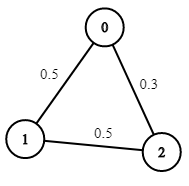

# Dijkstra's algorithm

## Algorithm Pattern
```
// return the weight from 'from' to 'to'
int weight(int from, int to);

// return all of the adjecent nodes of s
List<Integer> adj(int s);

// a state class for node
class State {
    // node id
    int id;
    // distance from start node to current node
    int distFromStart;

    State(int id, int distFromStart) {
        this.id = id;
        this.distFromStart = distFromStart;
    }
}

// input: start and graph
// output: the minimum distance from start to each node
int[] dijkstra(int start, List<Integer>[] graph) {
    // get the number of nodes in graoh
    int V = graph.length;
    // the minimum distance from start node to each node
    int[] distTo = new int[V];
    // initialize as max value and will be replaced with true value
    Arrays.fill(distTo, Integer.MAX_VALUE);
    // base case, the distance from start to start is 0
    distTo[start] = 0;

    // the smaller distance should be priority
    Queue<State> pq = new PriorityQueue<>((a, b) -> {
        return a.distFromStart - b.distFromStart;
    });

    // insert start node for BFS
    pq.offer(new State(start, 0));

    // if pq is not empty
    while (!pq.isEmpty()) {
        State curState = pq.poll();
        int curNodeID = curState.id; // get the current node id
        int curDistFromStart = curState.distFromStart; // get the current node distance

        // if a smaller distance stored already, continue
        if (curDistFromStart > distTo[curNodeID]) {
            continue;
        }
        // check all of the adjacent nodes 
        for (int nextNodeID : adj(curNodeID)) {
            // check if smaller distance available
            int distToNextNode = distTo[curNodeID] + weight(curNodeID, nextNodeID);
            if (distTo[nextNodeID] > distToNextNode) {
                // update
                distTo[nextNodeID] = distToNextNode;
                // insert this adjacent node
                pq.offer(new State(nextNodeID, distToNextNode));
            }
        }
    }
    return distTo;
}
```
#### Time Complexity
- Best Case: O(ElogV), E - number of edges, V - number of nodes
- Java PQ Case: O(ElogE), duplicate nodes

## LeetCode

- 743.Network Delay Time
- 1514.Path with Maximum Probability
- 1631.Path With Minimum Effort

### 743. Network Delay Time
You are given a network of n nodes, labeled from 1 to n. You are also given times, a list of travel times as directed edges times[i] = (ui, vi, wi), where ui is the source node, vi is the target node, and wi is the time it takes for a signal to travel from source to target.

We will send a signal from a given node k. Return the minimum time it takes for all the n nodes to receive the signal. If it is impossible for all the n nodes to receive the signal, return -1.


Example 1:


```
Input: times = [[2,1,1],[2,3,1],[3,4,1]], n = 4, k = 2
Output: 2
```
Example 2:
```
Input: times = [[1,2,1]], n = 2, k = 1
Output: 1
```
Example 3:
```
Input: times = [[1,2,1]], n = 2, k = 2
Output: -1
```

Actually, this problem asks you what is the `longest` path from all of the `shortest` path start from node k?

#### My Solution:
```
/*
 * 12-10-2022
 * Author @ LBLD
 */
int networkDelayTime(int[][] times, int n, int k) {
    // node starts from 1, so we need n + 1 solts
    List<int[]>[] graph = new LinkedList[n + 1];
    for (int i = 1; i <= n; i++) {
        graph[i] = new LinkedList<>();
    }
    
    // build the graph
    for (int[] edge : times) {
        int from = edge[0];
        int to = edge[1];
        int weight = edge[2];
        // from -> List<(to, weight)>
        graph[from].add(new int[]{to, weight});
    }
    // call dijstr's algorithm to calcate the distance starting from k
    int[] distTo = dijkstra(k, graph);

    // find the longest one
    int res = 0;
    for (int i = 1; i < distTo.length; i++) {
        if (distTo[i] == Integer.MAX_VALUE) {
            // unreachable, return -1
            return -1;
        }
        res = Math.max(res, distTo[i]);
    }
    return res;
}

// Dijkstra's algorithm
class State {
    int id;
    int distFromStart;

    State(int id, int distFromStart) {
        this.id = id;
        this.distFromStart = distFromStart;
    }
}

int[] dijkstra(int start, List<int[]>[] graph) {
    int[] distTo = new int[graph.length];
    Arrays.fill(distTo, Integer.MAX_VALUE);
    distTo[start] = 0;

    Queue<State> pq = new PriorityQueue<>((a, b) -> {
        return a.distFromStart - b.distFromStart;
    });
    pq.offer(new State(start, 0));

    while (!pq.isEmpty()) {
        State curState = pq.poll();
        int curNodeID = curState.id;
        int curDistFromStart = curState.distFromStart;

        if (curDistFromStart > distTo[curNodeID]) {
            continue;
        }

        for (int[] neighbor : graph[curNodeID]) {
            int nextNodeID = neighbor[0];
            int distToNextNode = distTo[curNodeID] + neighbor[1];
            if (distTo[nextNodeID] > distToNextNode) {
                distTo[nextNodeID] = distToNextNode;
                pq.offer(new State(nextNodeID, distToNextNode));
            }
        }
    }
    return distTo;
}
```

### 1514. Path with Maximum Probability

You are given an undirected weighted graph of n nodes (0-indexed), represented by an edge list where edges[i] = [a, b] is an undirected edge connecting the nodes a and b with a probability of success of traversing that edge succProb[i].

Given two nodes start and end, find the path with the maximum probability of success to go from start to end and return its success probability.

If there is no path from start to end, return 0. Your answer will be accepted if it differs from the correct answer by at most 1e-5.

Example 1:


```
Input: n = 3, edges = [[0,1],[1,2],[0,2]], succProb = [0.5,0.5,0.2], start = 0, end = 2
Output: 0.25000
Explanation: There are two paths from start to end, one having a probability of success = 0.2 and the other has 0.5 * 0.5 = 0.25.
```

Example 2:



```
Input: n = 3, edges = [[0,1],[1,2],[0,2]], succProb = [0.5,0.5,0.3], start = 0, end = 2
Output: 0.30000
```


Example 3:


```
Input: n = 3, edges = [[0,1]], succProb = [0.5], start = 0, end = 2
Output: 0.00000
Explanation: There is no path between 0 and 2.
```

#### My Solution
```
/*
 * 12-10-2022
 * Author @ LBLD
 */
 
 class Solution {
    double maxProbability(int n, int[][] edges, double[] succProb, int start, int end) {
        List<double[]>[] graph = new LinkedList[n];
        for (int i = 0; i < n; i++) {
            graph[i] = new LinkedList<>();
        }
        // build the graph
        for (int i = 0; i < edges.length; i++) {
            int from = edges[i][0];
            int to = edges[i][1];
            double weight = succProb[i];
            // turn undirected graph to bi-directed graph
            graph[from].add(new double[]{(double)to, weight});
            graph[to].add(new double[]{(double)from, weight});
        }
        
        return dijkstra(start, end, graph);
    }

    class State {
        int id;
        double probFromStart;

        State(int id, double probFromStart) {
            this.id = id;
            this.probFromStart = probFromStart;
        }
    }

    double dijkstra(int start, int end, List<double[]>[] graph) {
        // highest probability from start to current node
        double[] probTo = new double[graph.length];
        // init as -1
        Arrays.fill(probTo, -1);
        // base case, we must reach start while in start
        probTo[start] = 1;

        // priority highest probability
        Queue<State> pq = new PriorityQueue<>((a, b) -> {
            return Double.compare(b.probFromStart, a.probFromStart);
        });

        // start BFS
        pq.offer(new State(start, 1));

        while (!pq.isEmpty()) {
            State curState = pq.poll();
            int curNodeID = curState.id;
            double curProbFromStart = curState.probFromStart;

            // if reach the end, return
            if (curNodeID == end) {
                return curProbFromStart;
            }
            
            // could reach here in a higher probability
            if (curProbFromStart < probTo[curNodeID]) {
                continue;
            }

            // check the adjacent nodes
            for (double[] neighbor : graph[curNodeID]) {
                // cast double to int
                int nextNodeID = (int)neighbor[0];
                // calculate the probability from start to next
                double probToNextNode = probTo[curNodeID] * neighbor[1];
                if (probTo[nextNodeID] < probToNextNode) {
                    probTo[nextNodeID] = probToNextNode;
                    pq.offer(new State(nextNodeID, probToNextNode));
                }
            }
        }
        // if can't reach end, return 0.0
        return 0.0;
    }
}
```

### 1631. Path With Minimum Effort

You are a hiker preparing for an upcoming hike. You are given heights, a 2D array of size rows x columns, where heights[row][col] represents the height of cell (row, col). You are situated in the top-left cell, (0, 0), and you hope to travel to the bottom-right cell, (rows-1, columns-1) (i.e., 0-indexed). You can move up, down, left, or right, and you wish to find a route that requires the minimum effort.

A route's effort is the maximum absolute difference in heights between two consecutive cells of the route.

Return the minimum effort required to travel from the top-left cell to the bottom-right cell.

Example 1:


```
Input: heights = [[1,2,2],[3,8,2],[5,3,5]]
Output: 2
Explanation: The route of [1,3,5,3,5] has a maximum absolute difference of 2 in consecutive cells.
This is better than the route of [1,2,2,2,5], where the maximum absolute difference is 3.
```

Example 2:


```
Input: heights = [[1,2,3],[3,8,4],[5,3,5]]
Output: 1
Explanation: The route of [1,2,3,4,5] has a maximum absolute difference of 1 in consecutive cells, which is better than route [1,3,5,3,5].
```


Example 3:


```
Input: heights = [[1,2,1,1,1],[1,2,1,2,1],[1,2,1,2,1],[1,2,1,2,1],[1,1,1,2,1]]
Output: 0
Explanation: This route does not require any effort.
```

We can see the `effor` as `weight`, so we can use Dijkstra's algorithm to find the minimum path from top-left to right-bottom.

#### My Solution
```
/* 
 * 12-10-2022
 * Author @ LBLD
 */

class Solution {

    // dir array
    public int[][] dirs = new int[][]{{0,1}, {1,0}, {0,-1}, {-1,0}};

    // helper function to get the adjacent coordinate
    public List<int[]> adj(int[][] matrix, int x, int y) {
        int m = matrix.length, n = matrix[0].length;

        List<int[]> neighbors = new ArrayList<>();
        for (int[] dir : dirs) {
            int nx = x + dir[0];
            int ny = y + dir[1];
            // invalid
            if (nx >= m || nx < 0 || ny >= n || ny < 0) {
                continue;
            }
            neighbors.add(new int[]{nx, ny});
        }
        return neighbors;
    }

    class State {
        // coordinate
        int x, y;
        // minimum effort from start
        int effortFromStart;

        State(int x, int y, int effortFromStart) {
            this.x = x;
            this.y = y;
            this.effortFromStart = effortFromStart;
        }
    }

    // Dijkstra, from (0, 0) -> (m - 1, n - 1)
    public int minimumEffortPath(int[][] heights) {
        int m = heights.length, n = heights[0].length;
        int[][] effortTo = new int[m][n];
        for (int i = 0; i < m; i++) {
            Arrays.fill(effortTo[i], Integer.MAX_VALUE);
        }
        // base case
        effortTo[0][0] = 0;

        // priority smaller effort
        Queue<State> pq = new PriorityQueue<>((a, b) -> {
            return a.effortFromStart - b.effortFromStart;
        });
        
        // start from (0, 0) with 0 effort
        pq.offer(new State(0, 0, 0));

        while (!pq.isEmpty()) {
            State curState = pq.poll();
            int curX = curState.x;
            int curY = curState.y;
            int curEffortFromStart = curState.effortFromStart;
            
            // end if reach the (m - 1, n - 1)
            if (curX == m - 1 && curY == n - 1) {
                return curEffortFromStart;
            }
            
            // continue if get the smaller already
            if (curEffortFromStart > effortTo[curX][curY]) {
                continue;
            }
            // check all of the adjacent cells
            for (int[] neighbor : adj(heights, curX, curY)) {
                int nextX = neighbor[0];
                int nextY = neighbor[1];
                // calculate the effort
                int effortToNextNode = Math.max(
                    effortTo[curX][curY], 
                    Math.abs(heights[curX][curY] - heights[nextX][nextY])
                );
                // update
                if (effortTo[nextX][nextY] > effortToNextNode) {
                    effortTo[nextX][nextY] = effortToNextNode;
                    pq.offer(new State(nextX, nextY, effortToNextNode));
                }
            }
        }
        // if can't reach the end
        return -1;
    }
}
```


