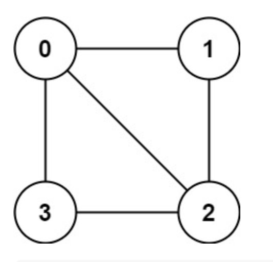
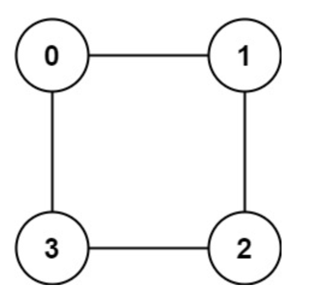

# Maximum bipartite matching (Bipartite Graph)

## Note - Bipartite Graph

We could use bipartite-graph to store some data.

For example, if we want to store the movies and actors, what can we do?

Of course, we could use two HashMap<String, List<String>>.

For one, the movies could be used as the Key, and for another, the actors could be used as the Key.

But we could use bipartite-graph as an alternate way, for every two adjacent nodes, one is actor, and one is the movie.

## Algorithm Pattern
We could image that we use two colors to dye two nodes connected by edge. And see if we can finish this process.
```
/* Graph Traverse */
void traverse(Graph graph, boolean[] visited, int v) {
    visited[v] = true;
    // go over all the adjacent nodes
    for (int neighbor : graph.neighbors(v)) {
        if (!visited[neighbor]) {
            // if neighbor nodes not be visited
            // color it
            traverse(graph, visited, neighbor);
        } else {
            // if neighbor node has been visited
            // compare the color with current one
            // if same, then the graph is not bipartite graph
        }
    }
}
```

## LeetCode

- 785.Is Graph Bipartite?
- 886.Possible Bipartition

### 785. Is Graph Bipartite?

There is an undirected graph with n nodes, where each node is numbered between 0 and n - 1. You are given a 2D array graph, where graph[u] is an array of nodes that node u is adjacent to. More formally, for each v in graph[u], there is an undirected edge between node u and node v. The graph has the following properties:

There are no self-edges (graph[u] does not contain u).
There are no parallel edges (graph[u] does not contain duplicate values).
If v is in graph[u], then u is in graph[v] (the graph is undirected).
The graph may not be connected, meaning there may be two nodes u and v such that there is no path between them.
A graph is bipartite if the nodes can be partitioned into two independent sets A and B such that every edge in the graph connects a node in set A and a node in set B.

Return true if and only if it is bipartite.


Example 1:



```
Input: graph = [[1,2,3],[0,2],[0,1,3],[0,2]]
Output: false
Explanation: There is no way to partition the nodes into two independent sets such that every edge connects a node in one and a node in the other.
```


Example 2:



```
Input: graph = [[1,3],[0,2],[1,3],[0,2]]
Output: true
Explanation: We can partition the nodes into two sets: {0, 2} and {1, 3}.
```

Constraints:

- graph.length == n
- 1 <= n <= 100
- 0 <= graph[u].length < n
- 0 <= graph[u][i] <= n - 1
- graph[u] does not contain u.
- All the values of graph[u] are unique.
- If graph[u] contains v, then graph[v] contains u.

### My Solution - DFS
```aidl
/*
 * Author @ LBLD
 * 12-18-2022
 */
// if the graph is bipartite 
private boolean ok = true;
// two colors - true and false
private boolean[] color;
// if node visited
private boolean[] visited;

// main function
public boolean isBipartite(int[][] graph) {
    int n = graph.length;
    color =  new boolean[n];
    visited =  new boolean[n];
    
    // we have to check each node
    // in case there exist some disconnected graph
    for (int v = 0; v < n; v++) {
        if (!visited[v]) {
            traverse(graph, v);
        }
    }
    return ok;
}

// DFS
private void traverse(int[][] graph, int v) {
    // if not bipartite, return
    if (!ok) return;

    visited[v] = true; // mark as visited
    
    for (int w : graph[v]) { // check each adjacent node
        if (!visited[w]) {
            // if neighbor w not visited
            // color w with different color v has
            color[w] = !color[v];
            // continue traverse
            traverse(graph, w);
        } else {
            // w visited already, check if the color same
            if (color[w] == color[v]) {
                // if same, not bipartite graph
                ok = false;
                return;
            }
        }
    }
}
```

### My Solution - DFS
```aidl
/*
 * Author @ LBLD
 * 12-18-2022
 */
 
// same as above
private boolean ok = true;
private boolean[] color;
private boolean[] visited;

public boolean isBipartite(int[][] graph) {
    int n = graph.length;
    color =  new boolean[n];
    visited =  new boolean[n];
    
    for (int v = 0; v < n; v++) {
        if (!visited[v]) {
            // run bfs
            bfs(graph, v);
        }
    }
    
    return ok;
}

// 从 start 节点开始进行 BFS 遍历
private void bfs(int[][] graph, int start) {
    Queue<Integer> q = new LinkedList<>();
    visited[start] = true;
    q.offer(start);
    
    while (!q.isEmpty() && ok) {
        int v = q.poll();
        // span neighbor nodes start from v
        for (int w : graph[v]) {
            if (!visited[w]) {
                color[w] = !color[v];
                visited[w] = true;
                q.offer(w);
            } else {
                if (color[w] == color[v]) {
                    ok = false;
                    return;
                }
            }
        }
    }
}

```

### 886. Possible Bipartition
We want to split a group of n people (labeled from 1 to n) into two groups of any size. Each person may dislike some other people, and they should not go into the same group.

Given the integer n and the array dislikes where dislikes[i] = [ai, bi] indicates that the person labeled ai does not like the person labeled bi, return true if it is possible to split everyone into two groups in this way.


Example 1:
```
Input: n = 4, dislikes = [[1,2],[1,3],[2,4]]
Output: true
Explanation: group1 [1,4] and group2 [2,3].
```

Example 2:

```
Input: n = 3, dislikes = [[1,2],[1,3],[2,3]]
Output: false
```

Example 3:
```
Input: n = 5, dislikes = [[1,2],[2,3],[3,4],[4,5],[1,5]]
Output: false
```

Constraints:
- 1 <= n <= 2000
- 0 <= dislikes.length <= 104
- dislikes[i].length == 2
- 1 <= dislikes[i][j] <= n
- ai < bi
- All the pairs of dislikes are unique.

### My Solution
```aidl
/*
 * Author @ LBLD
 * 12-18-2022
 */
 class Solution {
    // if possible bipartition
    private boolean ok = true;
    // two colors - true and false
    private boolean[] color;
    // if nodes visited
    private boolean[] visited;

    // main function
    public boolean possibleBipartition(int n, int[][] dislikes) {
        // why n + 1?
        // because we start label from 1
        color = new boolean[n + 1];
        visited = new boolean[n + 1];
        // build graph
        List<Integer>[] graph = buildGraph(n, dislikes);
        
        for (int v = 1; v <= n; v++) {
            if (!visited[v]) {
                traverse(graph, v);
            }
        }
        
        return ok;
    }

    // function - build graph
    private List<Integer>[] buildGraph(int n, int[][] dislikes) {
        // node labeled as 1...n
        List<Integer>[] graph = new LinkedList[n + 1];

        // initialize the node
        for (int i = 1; i <= n; i++) {
            graph[i] = new LinkedList<>();
        }

        // initialize the adjacent nodes
        for (int[] edge : dislikes) {
            int v = edge[1];
            int w = edge[0];
            // v -> w
            graph[v].add(w);
            // w -> v
            graph[w].add(v);
        }
        return graph;
    }

    // traverse function
    private void traverse(List<Integer>[] graph, int v) {
        if (!ok) return;
        visited[v] = true;
        for (int w : graph[v]) {
            if (!visited[w]) {
                color[w] = !color[v];
                traverse(graph, w);
            } else {
                if (color[w] == color[v]) {
                    ok = false;
                    return;
                }
            }
        }
    }
}
```